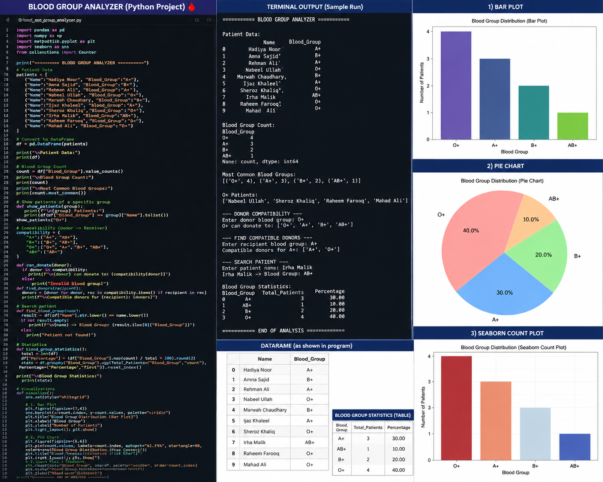

# 🩸 Blood Group Analyzer

A Python-based Blood Group Analyzer that manages patient blood group data, analyzes blood group distribution, identifies compatible donors and recipients, searches patient records, generates statistics, and visualizes the data using Python libraries.

## 🚀 Features

* Store and manage patient blood group data
* Analyze blood group distribution
* Find the most common blood group
* Search patients by name
* Display patients with a specific blood group
* Check blood donor compatibility
* Find compatible donors for a recipient
* Generate blood group statistics and percentages
* Create data visualizations

## 📊 Visualizations

This project includes:

* Bar Chart
* Pie Chart
* Seaborn Count Plot

These visualizations help analyze the distribution of blood groups among patients.

## 🛠️ Technologies Used

* Python
* Pandas
* NumPy
* Matplotlib
* Seaborn

## 📂 Project Structure

```text
Blood-Group-Analyzer/
│
├── blood_group_analyzer.py
├── Blood_Group_Analysis_Visualization.png
└── README.md
```

## ▶️ How to Run

Install the required libraries:

```bash
pip install pandas numpy matplotlib seaborn
```

Run the program:

```bash
python blood_group_analyzer.py
```

## 📈 Project Output

The program provides:

* Patient data analysis
* Blood group counts
* Most common blood group
* Donor-recipient compatibility
* Patient search functionality
* Blood group statistics
* Data visualization charts


## 🎯 Purpose

This project was created to practice Python programming, data analysis, data visualization, and basic blood group compatibility concepts.

---

⭐ If you like this project, feel free to star the repository!
